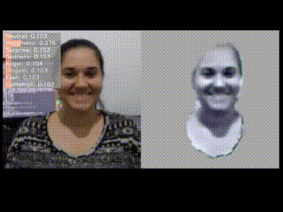
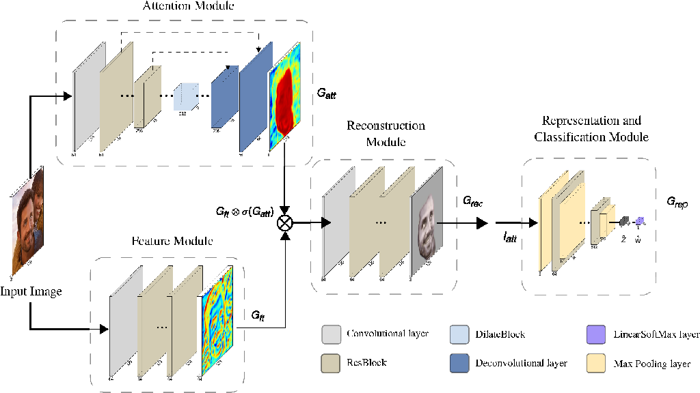
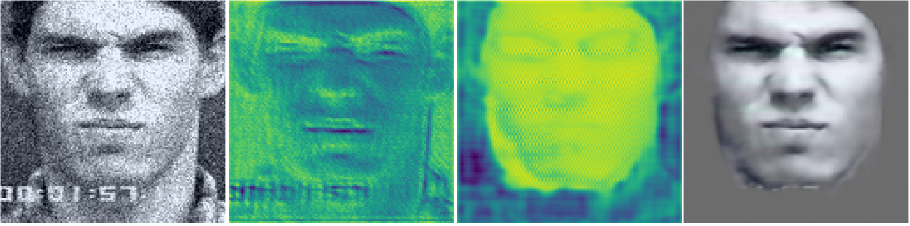

# FERAtt: Facial Expression Recognition with Attention Net

Introduction
------------

Pytorch implementation for FERAtt neural net. Facial Expression Recognition with Attention Net (FERAtt), is based on the dual-branch architecture and consists of four major modules: (i) an attention module $G_{att}$ to extract the attention feature map, (ii) a feature extraction module $G_{ft}$ to obtain essential features from the input image $I$, (iii) a reconstruction module $G_{rec}$ to estimate a good attention image $I_{att}$, and (iv) a representation module $G_{rep}$ that is responsible for the representation and classification of the facial expression image.

The implementation is find [here](torchlib/models/atentionpreactresnet.py).

## Prerequisites
- Linux or macOS
- Python 3
- NVIDIA GPU + CUDA cuDNN
- PyTorch 0.4

Installation
------------

    $git clone https://github.com/pedrodiamel/pytorchvision.git
    $cd pytorchvision
    $python setup.py install
    $pip install -r installation.txt

### Visualize result with Visdom

We now support Visdom for real-time loss visualization during training!

To use Visdom in the browser:

    # First install Python server and client 
    pip install visdom
    # Start the server (probably in a screen or tmux)
    python -m visdom.server -env_path runs/visdom/
    # http://localhost:8097/

How use
------------

### Step 1: Train

    ./train_bu3dfe.sh
    ./train_ck.sh
    
### Step 2: Eval
For evaluation we used the notebook [eval.ipynb](./books/eval.ipynb)

Results
------------

### Attention Module Results

### Classification Result

In all experiments we considered the architecture PreActResNet18 for the classification and representation processes. We adopted two approaches: (1) a model with attention and classification, FERAtt+Cls, and (2) a model with attention, classification, and representation, FERAtt+Rep+Cls. These were compared with the classification results. For the representation, the last convolutional layer of PreActResNet is evaluated by a linear layer to generate a vector of selected size. We have opted for 64 dimensions for the representation vector $\hat{z}$. All models were trained on Nvidia GPUs (P100, K80, Titan XP) using [PyTorch](http://pytorch.org/) for 60 epochs on the training set with 200 examples per mini batch and employing the Adam optimizer. Face images were rescaled to 32x32 pixels in classification step.

Classification results for the **Synthetic BU-3DFE** database applied to seven expressions.

| Method            | Acc.        | Prec.       | Rec.       | F1.        |
| ----------------- | ----------- | ----------- |----------- |----------- |
| PreActResNet18    | 69.37%      | 71.48%      | 69.56%     | 70.50%     |
| FERAtt+Cls        | 75.15%      | 77.34%      | 75.45%     | 76.38%     |
| FERAtt+Rep+Cls    | **77.90%**  | 79.58%      | 78.05%     | 78.81      |

Classification results for the **Real BU-3DFE** database applied to seven expressions.

| Method            | Acc.        | Prec.       | Rec.       | F1.        |
| ----------------- | ----------- | ----------- |----------- |----------- |
| PreActResNet18    | 75.22%      | 77.58%      | 75.49%     | 76.52%     |  
| FERAtt+Cls        | 80.41%      | 82.30%      | 80.79%     | 81.54%     |
| FERAtt+Rep+Cls    | **82.11%**  | 83.72%      | 82.42%     | 83.06%     |

Classification results for the **Synthetic CK+** database applied to eight expressions.

| Method            | Acc.        | Prec.       | Rec.       | F1.        |
| ----------------- | ----------- | ----------- |----------- |----------- |
| PreActResNet18    | 77.63%      | 68.42%      | 68.56%     | 68.49%     |   
| FERAtt+Cls        | 84.60%      | 74.94%      | 76.30%     | 75.61%     |
| FERAtt+Rep+Cls    | **85.15%**  | 74.68%      | 77.45%     | 76.04%     |

Classification results for the **Real CK+** database applied to eight expressions.

| Method            | Acc.        | Prec.       | Rec.       | F1.        |
| ----------------- | ----------- | ----------- |----------- |----------- |
| PreActResNet18    | 86.67%      | 81.62%      | 80.15%     | 80.87%     |   
| FERAtt+Cls        | 85.42%      | 75.65%      | 78.79%     | 77.18%     |
| FERAtt+Rep+Cls    | **90.30%**  | 83.64%      | 84.90%     | 84.25%     |

Acknowledgments
------------

Gratefully acknowledge financial support from the Brazilian government agency FACEPE. 
